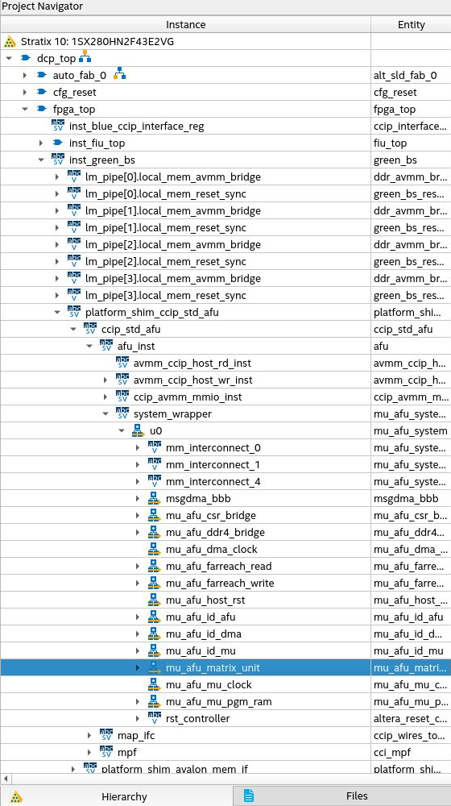

## Matrix Unit AFU

### DevCloud login
1. Get an SSH key from DevCloud
    - If you weren't issued one or it was lost navigate [here](https://devcloud.intel.com/oneapi/documentation/), login, and follow the access instructions for your OS.
    - The VS Code setup instructions can also be found at the link above.

2. SSH to a headnode
    ``` console
    uXXXXX@login2:~$ ssh devcloud
    ```

3. Log into a Stratix 10 Node
    ``` console
    uXXXXX@login2:~$ source /data/intel_fpga/devcloudLoginToolSetup.sh
    uXXXXX@login2:~$ devcloud_login
    ```

    after running the above command you can either get a Stratix 10 node assigned to you or select a particular node using option 6. After logging in, you may work on the deign from the command line or setup your preferred development environment.

### Development
1. After logging into an S10 node the Quartus GUI may be accessed using X2Go. See documentation [here](https://devcloud.intel.com/oneapi/documentation/shell-commands/#graphics-usage-on-the-fpga-devcloud).

2. The Matrix Unit RTL modified for the AFU may be found at ```afu/pd/matrix_unit```.

3. The Platform Designer system instantiating the Matrix Unit IP may be opened from the Quartus GUI

    1. In a terminal connected to the S10 node create the AFU project by running the following commands.

    ``` console
    uXXXXX@s00X-n00X:~$ source /data/intel_fpga/devcloudLoginToolSetup.sh
    uXXXXX@s00X-n00X:~$ tools_setup -t S10DS
    uXXXXX@s00X-n00X:~$ afu_synth_setup -s afu/rtl/filelist.txt -f afu/build_synth
    ```

    2. Then login to X2Go, open a terminal in the X2Go session, and setup the quartus tools

    ``` console
    uXXXXX@s00X-n00X:~$ source /data/intel_fpga/devcloudLoginToolSetup.sh
    uXXXXX@s00X-n00X:~$ tools_setup -t S10DS
    uXXXXX@s00X-n00X:~$ quartus [/path/to/repo/]afu/build_synth/build/dcp.qpf &
    ```

    3. To modify the Matrix Unit AFU Platform Designer system navigate to IP Components and click ```mu_afu_system```

    4. The position of the Platform Designer system in the hierarchy can be viewed by clicking the ```Hierarchy``` tab in the main Quartus window.

        


### Compiling the design
1. When you are ready to compile, you will want to submit the compile as a batch job. An example compile batch script for this AFU is located at ```afu/devcloud_batch.sh```

2. To run the script complete Parts 1-2 in the DevCloud login instructions above. Then run the following command

    ``` console
    uXXXXX@login2:~$ devcloud_login -b S10PAC [/path/to/repo]/ternary_matmul/afu/devcloud_batch.sh
    ```

3. The status of the job can be queried by running the following command

    ``` console
    uXXXXX@login2:~$ qstatus
    ```

4. Logs for the compile and the .gbs file will be located in the ```afu/build_synth/output_files``` directory.

5. If you would like to terminate a job, get the job ID by running ```qstatus``` then run ```qdel [Job ID]```

    - Note that the Job ID is usually truncated it should end in ```.aidevcloud```

### Simulation
1. This accelerator may be simulated usign ASE. See the documentation [here](https://www.intel.com/content/www/us/en/docs/programmable/683159/2-0/introduction.html) and [here](https://opae.github.io/0.13.0/docs/ase_userguide/ase_userguide.html)

2. To simulate either ModelSim/QuestaSim or VCS and OPAE must be installed on your system.

3. To prepare the simulation environment run the following command.

    ``` console
    cd afu/ 
    afu_sim_setup --source hw/rtl/filelist.txt build_sim
    cd build_sim
    make
    make sim
    ```

4. You may use the OPAE C/C++ API to run tests and observe the AFU waveforms. The wrapper for the Matrix Unit AFU is similar to the DMA AFU example included in cd ```$OPAE_PLATFORM_ROOT/hw/samples/dma_afu/sw```. As such a testbench may be developed using the example see [here](https://www.intel.com/content/www/us/en/docs/programmable/683270/2-0-1/running-dma-afu-example.html) for documentation. TODO: implement ASE testbench.

### Running the AFU

After the design compiles, the ```afu/py/profile_core.py``` script may be run to profile the AFU. The script programs the .gbs file, assembles and programs the matrix unit core instruction memory, and applies random test vectors. The script will not perform functional verification beyond checking that output vectors are updated. TODO: compare the output to a golden reference model. Prebuilt GBS files are available w/ varyious vector dimensions in the gbs_archive directory. To procedure to test the designs is as follows

1. Untar the archive (this example will show the flow for a design with D=512)

    ``` console
    uXXXXX@s00X-n00X:~$ tar -xvf afu/gbs_archive/512.tar afu/gbs_archive/512/
    uXXXXX@s00X-n00X:~$ tools_setup -t S10DS
    uXXXXX@s00X-n00X:~$ quartus [/path/to/repo/]afu/build_synth/build/dcp.qpf &                             
    ```
2. Setup the tools

    ``` console
    uXXXXX@s00X-n00X:~$ source /data/intel_fpga/devcloudLoginToolSetup.sh
    uXXXXX@s00X-n00X:~$ tools_setup -t S10DS              
    ```

4. Check the ```afu/gbs_archive/512/output_files/user_clock_freq.txt``` file to determine the clock rate for the core

    ``` console
    uXXXXX@s00X-n00X:~$ cat afu/gbs_archive/512/output_files/user_clock_freq.txt
    # Generated by Platform Interface Manager user_clock_config.tcl
    afu-image/clock-frequency-low:30.5
    afu-image/clock-frequency-high:61
    ```

3. Profile the workload

    ``` console
    uXXXXX@s00X-n00X:~$ python3 afu/py/profile_core.py --gbs afu/gbs_archive/512/mu_afu_S10.gbs --tmi_asm tmi/process.tmi --dim 512 --fclk_mhz 61            
    ```